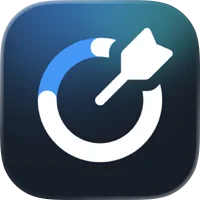
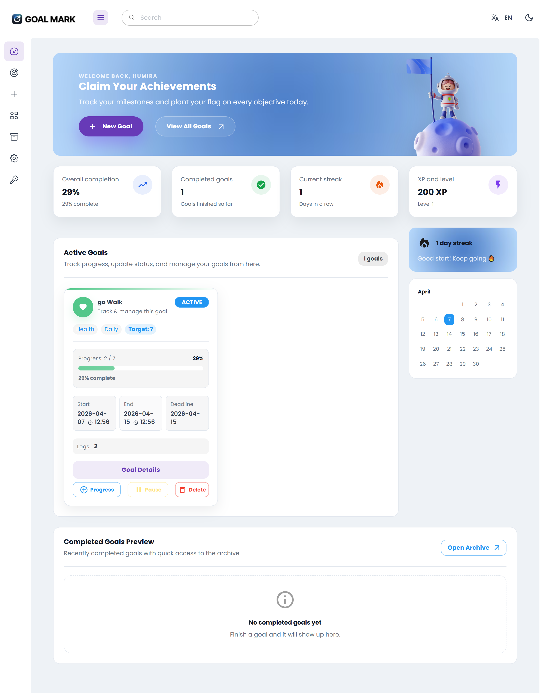
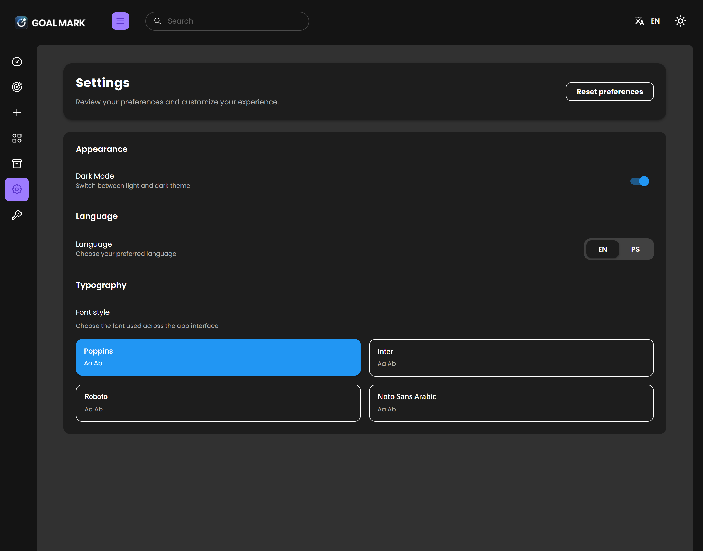

# 🚀 GOAL-TRACKER



> A modern, feature-rich goal tracking application built with React and Material UI.

---

--📖 Introduction

The Goal Tracker Dashboard is a multipage React web application designed to help users create, manage, and track their personal goals and habits. It provides a clean, responsive interface where users can monitor active goals, view progress, track streaks, earn XP, and manage completed goals in an organized dashboard. This app is ideal for anyone looking to improve productivity, stay consistent with habits, and visually track their progress over time.

✨ Key Features
  ✔ Goal Management (CRUD) – Create, edit, delete, and view goals with categories, types, and target progress.
 ✔  Progress Tracking – Log daily progress for each goal with automatic percentage calculation and completion detection.
  ✔ Streak & XP System – Track consecutive goal completion days (streak) and earn XP points for progress.
 Completed Goals Archive – Move completed goals to an archive with optional restore functionality.
  ✔ Multi-language Support – English and another language (e.g., Pashto or Arabic) with RTL/LTR layout switching.
  ✔ Dark/Light Mode – Toggle between light and dark themes for better accessibility.
  ✔ Responsive UI – Fully responsive design for desktop and mobile devices.
  ✔ Firebase Authentication – Secure login and user-specific goal tracking using Firebase auth.
  ✔ Notifications / Reminders – (Optional/Implemented) Remind users to log daily progress.
  ✔ Charts & Visuals – Progress bars, category charts, and dashboard visualizations.

🛠️ Technology Stack
• Frontend: React v19 + Vite v7
• UI Framework: Material UI (MUI) v7
• Forms & Validation: React Hook Form
• Charts & Visuals: Recharts
• Internationalization (i18n): react-i18next
• Icons: MUI Icons
• Authentication: Firebase Authentication

🏗️ Project Structure
src/
├── assets/         # Images, icons, fonts
├── ui-components/     # Reusable UI components (Cards, Buttons, Modals)
├── contexts/          # React Contexts (Theme, GoalContext etc)
├── services/         # Local storage helpers & goal data models
├── layout/          # Layout components (Sidebar, Navbar)
├── menu-items/       # Sidebar menu configuration
├── routes/            # Routing setup
├── themes/           # MUI theme customization
├── utils/             # Helper functions
├── views/goal-tracker  # Page-level components (Dashboard, Goals, Settings etc.)
└── App.js          # Root component

## 🚀 Getting Started

### Prerequisites
- [Node.js](https://nodejs.org/) 

### Installation
1. Clone the repository:
   ```bash
   git clone https://github.com/humairaa-k/Goal-Mark.git
   cd goal-tracker
   ```

2. Install dependencies:
   ```bash
   npm install
   ```

### Running Locally

Start the development server:
 ```bash
  npm run start
   ```

The application will be available at `http://localhost:3000` 


## 🌍 Internationalization & LTR/RTL
This project supports multiple languages and automatically adjusts the layout direction based on the selected language.

- LTR (Left-to-Right): Used for English. All text, menus, and components align naturally from left to right.
- RTL (Right-to-Left): Used for languages like Pashto or Arabic. The entire interface—including text, navigation, and progress components—flips to support right-to-left reading without breaking the layout or responsiveness.

## 🎨 Customization
- **Theming**: You can modify the global theme in `src/themes/`.

## 📸 Screenshots

### Desktop View
.png)

.png)
.png)



### Mobile View


### ⚠️ Notes

This project uses the Berry Free React template, which contains multiple prebuilt folders and package configurations. Only the app-specific files were modified, while template boilerplate files like package.json and Vite configs were left unchanged to ensure stability.

## 📄 License
Distributed under the MIT License. See `LICENSE` for more information.


